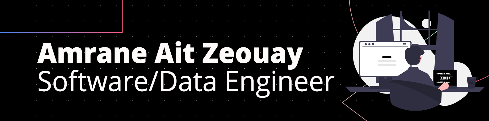

<h1>Hello there! I hope you will enjoy my Github profile.</h1>

Welcome to my humble Github.   I'm <b>Amrane, Data/Software Engineer</b> living in  <b>Argenteuil (Paris region), France</b>.

<h3>What I worked on:</h3>

  <h4>Data Engineer</h4>
  

        
  

  
  <h4>Software Engineer</h4>
  

             
  

  
  <h4>Databases</h4>
  

        
  

  
  <h4>Cloud</h4>
  

      
  

  <h4>DevOps Engineer</h4>
  

      
  

<h3>My Github Stats</h3>

<h3>You can reach me on:</h3>

   

<h3>My Resume</h3>
<a href="https://github.com/Amraneze/amraneze/raw/main/resume/AIT_ZEOUAY_AMRANE_FRENCH_CV.pdf" target="_blank">French</a>

<a href="https://github.com/Amraneze/amraneze/raw/main/resume/AIT_ZEOUAY_AMRANE_ENGLISH_CV.pdf" target="_blank">English</a>